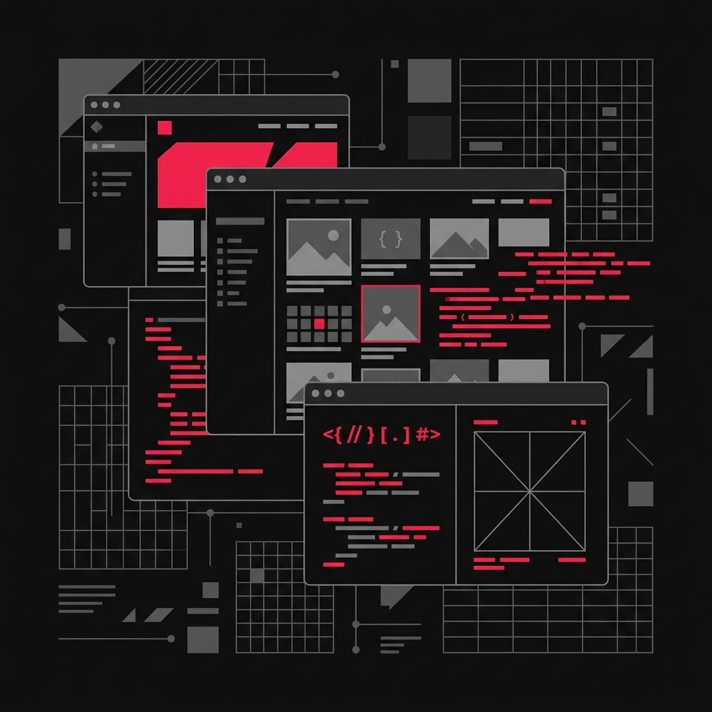

# Matías Blanc — Portfolio

Portfolio y blog personal construido con [Astro](https://astro.build), donde comparto mis proyectos, apuntes y posts sobre desarrollo.

<details>
  <summary>🇺🇸 <b>Click here to read in English / Read in English</b></summary>
  <br/>

  Personal portfolio and technical blog built with [Astro](https://astro.build), [React](https://react.dev), and [Tailwind CSS](https://tailwindcss.com), documenting technical projects, engineering insights, and development guides.
</details>



## ✨ Características

- ⚡ 100/100 en Lighthouse (rendimiento, accesibilidad, SEO y mejores prácticas)
- 🔍 SEO-friendly con URLs canónicas y Open Graph
- 🗺️ Sitemap y RSS feed generados automáticamente
- 📝 Contenido en Markdown y MDX con tipado de frontmatter
- 🎨 Estilos con Tailwind CSS 4 y tipografía personalizada
- 🧩 Componentes interactivos con React

## 🛠️ Stack

| Tecnología | Uso |
| --- | --- |
| [Astro](https://astro.build) | Framework del sitio |
| [React](https://react.dev) | Islas interactivas |
| [Tailwind CSS](https://tailwindcss.com) | Estilos |
| [MDX](https://mdxjs.com) | Contenido de posts y proyectos |
| [Bun](https://bun.sh) | Runtime y gestor de paquetes |

## 🚀 Proyectos destacados

- **Portfolio** — este sitio
- **ITF App** — [enlace al repo](https://github.com/MatiasBlanc)
- **Dotfiles** — [enlace al repo](https://github.com/MatiasBlanc)

## 📁 Estructura del proyecto

```text
├── public/          # Assets estáticos (imágenes, favicon)
├── src/
│   ├── components/  # Componentes Astro y React
│   ├── content/     # Colecciones: blog, projects, copilot
│   ├── layouts/     # Layouts base
│   ├── pages/       # Rutas del sitio
│   ├── consts.ts    # Constantes globales
│   └── global.css   # Estilos globales
├── astro.config.mjs
├── package.json
└── tsconfig.json
```

## 🧞 Comandos

Todos los comandos se ejecutan desde la raíz del proyecto:

| Comando | Acción |
| :--- | :--- |
| `bun install` | Instala las dependencias |
| `bun dev` | Inicia el servidor de desarrollo en `localhost:4321` |
| `bun build` | Genera el sitio de producción en `./dist/` |
| `bun preview` | Previsualiza el build localmente |
| `bun astro check` | Revisa tipos y HTML del proyecto |

## 🌐 Sitio en vivo

El sitio está desplegado en **[matiasblanc.dev](https://matiasblanc.dev)**.

## 📄 Licencia

[MIT](./LICENSE)

## 🙌 Créditos

Tema original basado en [Bear Blog](https://github.com/HermanMartinus/bearblog/), adaptado y extendido con Tailwind CSS.
